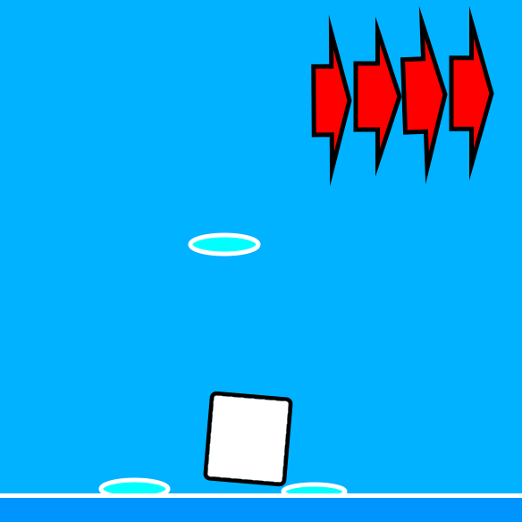

# icryzstal
Yerrrr



## Build instructions
For more info, see [our docs](https://docs.geode-sdk.org/getting-started/create-mod#build)
```sh
# Assuming you have the Geode CLI set up already
geode build
```